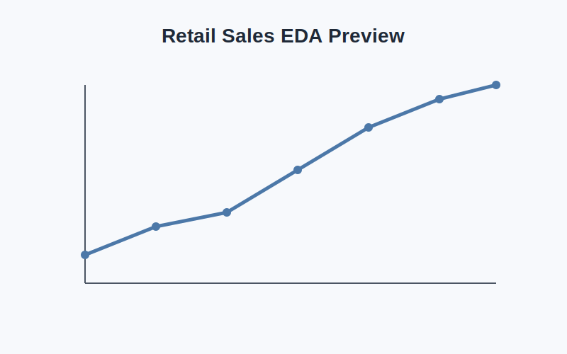
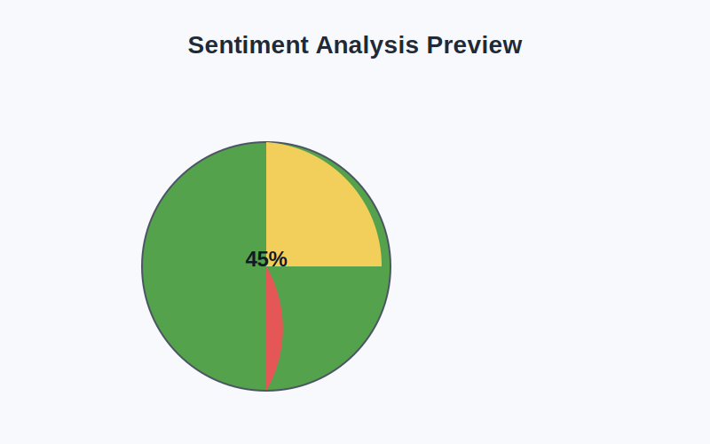
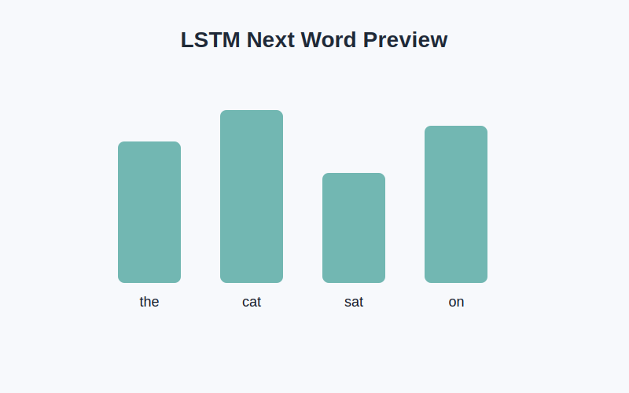

# Oasis Internship Projects

This repository contains a collection of machine learning and data analysis projects completed as part of the Oasis Internship tasks.

## Project Overview

The workspace includes three folders, each representing a different task:

1. Retail Sales EDA
   - Folder: siddhant jain - level 1 task 1
   - Description: Exploratory Data Analysis (EDA) on retail sales data.
   - Files:
     - Oasis_Retail_Sales_EDA_Template.ipynb
     - retail_sales_dataset.csv

2. Sentiment Analysis
   - Folder: siddhant jain - level 1 task 2
   - Description: Sentiment analysis project using Twitter text data.
   - Files:
     - Oasis_Sentiment_Analysis_Task4.ipynb
     - twitter_training.csv
     - twitter_validation.csv

3. Next Word Prediction with LSTM
   - Folder: siddhant jain - level 2 task 5
   - Description: Deep learning project for next-word prediction using an LSTM model.
   - Files:
     - lstm_next_word.ipynb
     - lstm_next_word_corpus.txt

## Project Screenshots







## Technologies Used

- Python
- Jupyter Notebook
- Pandas
- NumPy
- Matplotlib / Seaborn
- Machine Learning and Deep Learning libraries

## Purpose

These projects demonstrate practical experience in:
- Data cleaning and preprocessing
- Exploratory data analysis
- Text classification and sentiment analysis
- Neural network-based language modeling

## Repository Structure

```text
Oasis Internship/
├── siddhant jain - level 1 task 1/
├── siddhant jain - level 1 task 2/
├── siddhant jain - level 2 task 5/
└── README.md
```

## Author

Siddhant Jain
